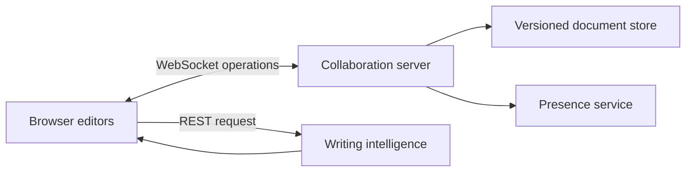

# DraftSync AI — Real-Time Collaborative Writing

DraftSync AI is a full-stack collaborative editor that synchronizes document operations across connected users and delivers explainable editorial suggestions for clarity, precision, and voice.

> This is a fresh, standalone portfolio implementation inspired by my experience building AI-assisted editorial collaboration systems. It uses original code and sample content and contains no employer, client, or UN proprietary code, data, prompts, or architecture.

## Product capabilities

- Live document synchronization over WebSockets
- Version-aware transformation of concurrent text operations
- Collaborator presence and activity indicators
- Server-authoritative document state and revision history
- Explainable writing analysis with evidence and recommendations
- Responsive editorial workspace
- Health and analysis REST endpoints
- Automated unit tests and continuous integration

## Architecture



Clients calculate compact single-span operations instead of sending the entire document. The server serializes edits and transforms operations created from older versions against intervening history. It then broadcasts one authoritative snapshot to every collaborator.

## Tech stack

- Node.js 20, Express
- Native WebSocket protocol with `ws`
- HTML, CSS, and JavaScript
- Node test runner
- Docker and GitHub Actions

## Run locally

```bash
npm install
npm start
```

Open `http://localhost:3000` in two browser windows to simulate multiple collaborators.

## Test

```bash
npm test
```

The test suite covers insertions, replacements, deletions, invalid ranges, minimal diffs, concurrent-operation transformation, versioned commits, and explainable writing analysis.

## API

| Method | Endpoint | Purpose |
| --- | --- | --- |
| `GET` | `/health` | Service and active-connection health |
| `GET` | `/api/document` | Current document snapshot and version |
| `POST` | `/api/suggestions` | Explainable editorial analysis |
| `WS` | `/collaborate` | Edits, presence, cursors, and snapshots |

## Engineering decisions

**Server-authoritative state.** All operations are ordered by the server, avoiding peer-to-peer divergence.

**Small operations.** A client sends the changed span, base version, and client identity rather than replacing the full document.

**Deterministic conflict handling.** Concurrent insertions use stable client IDs for ordering. This demo implements a focused transformation model; production collaboration could use a mature OT or CRDT library, durable event storage, and horizontal pub/sub.

**Explainability first.** Suggestions identify their category, supporting evidence, and recommended action. No external AI key is required, keeping the demo reproducible.

## Production roadmap

- Durable PostgreSQL event log and document recovery
- Redis pub/sub for horizontally scaled WebSocket nodes
- Authentication, document permissions, and share links
- Rich-text operations and selections
- LLM provider adapter with prompt/version audit logs
- Load testing and collaboration telemetry

## Project context

My May–August 2024 professional work included scaling a hackathon-winning AI content-feedback concept into a real-time collaboration experience. This public repository independently rebuilds the general engineering concepts for demonstration; it is not the original employer system.

## Author

**Aditi Jha** — AI/product builder and former software engineer, M.S. Management of Technology, NYU Tandon.

## License

MIT

